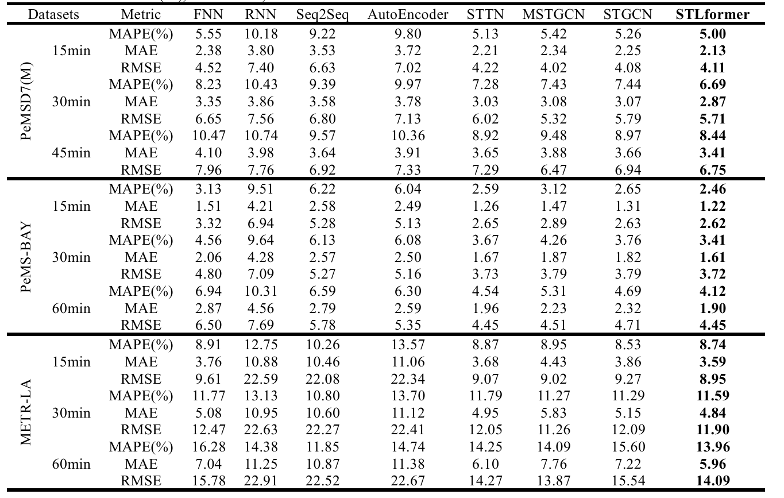

# Spatial-Temporal Dynamics Modeling for Traffic Flow Prediction: A Hybrid LSTM and Transformer Approach


## Requirements
- scipy==1.5.4
- numpy==1.19.5
- pandas==1.1.5
- keras==2.6.0
- tensorflow==1.4.0
- protobuf==3.19.6  


Dependency can be installed using the following command:
```bash
pip install -r requirements.txt
```

## Data Preparation
The traffic data files  PEMSD7(M), PeMS-BAY, and METR-LA datasets.They are available at [Google Drive](https://drive.google.com/open?id=10FOTa6HXPqX8Pf5WRoRwcFnW9BrNZEIX) or [Baidu Yun](https://pan.baidu.com/s/183zHtyHp2zAGxVxMH9n79Q?pwd=4444), and should be
put into the `data_loader/` folder.

### Metric for different horizons and datasets
The following table summarizes the performance of STLformer on three datasets with regards to different metrics and horizons.




